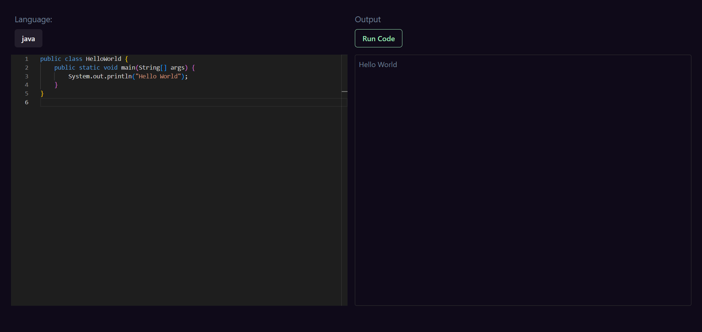

# In-Browser Code Editor

An interactive in-browser code editor that allows you to write and execute your code directly in the browser. Built with React and Vite, this tool offers a fast, efficient, and seamless development experience.

## Screenshots

_Editor Interface_

## Live Site

Check out the live site [https://c0de-editor.vercel.app/]

## Features

- Real-time code editing and execution in the browser.
- Built using React for a dynamic user interface.
- Powered by Vite for fast build and development.

## Technologies Used

- **React**: For building a fast and dynamic UI, providing a smooth user experience.
- **Vite**: Ensures rapid development with a highly optimized build process, supporting modern JavaScript features.
- **Monaco Editor**: An advanced code editor that powers Visual Studio Code, integrated for a powerful in-browser editing experience.
- **Chakra UI**: A simple, modular, and accessible component library for building React applications with ease.

## Installation and Usage

- Clone the repository: `git clone https://github.com/your-username/code-editor.git`
- Navigate to the project directory: `cd code-editor`
- Run `npm install` to install project dependencies.
- Run `npm run dev` to start the development server.
- Open your browser and visit `http://localhost:3000` (or the specified port) to view the application.

## Deployment

To deploy the application to production, run `npm run build`. This will create an optimized build in the dist folder, which can be deployed to a web server or hosting service of your choice.

## Contributing

Contributions to the project are welcome! Feel free to open issues and pull requests for bug fixes, improvements, or new features.

## License

This project is licensed under the [MIT License](LICENSE).
